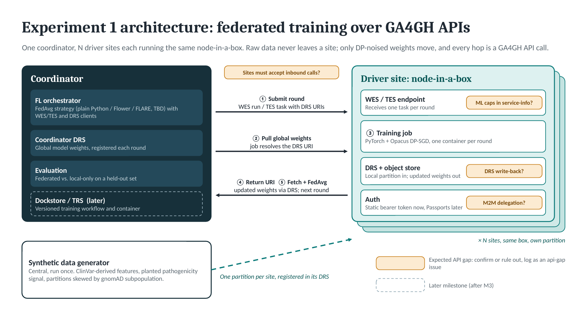

# GIF Project: Federated Learning with GA4GH APIs

A GA4GH Implementation Forum (GIF) project hosting configs, tutorials, scripts, and documentation for federated learning (FL) demonstrations built on GA4GH APIs.

**Project coordinator:** Brian O'Connor (Nimbus Informatics, GIF co-lead)

**Next event:** [Hackathon, Friday October 2, 2026](HACKATHON.md) (3 hours, hybrid)

Contents: [Background](#background) · [Experiment 1 plan](#experiment-1-plan) · [Architecture](#architecture) · [Near-term plan](#near-term-plan-next-10-weeks) · [Workstreams](#workstreams-champions-needed) · [Tracking API gaps](#tracking-api-gaps) · [Decisions](#decisions) · [Longer-term plan](#longer-term-plan-12-months) · [Getting involved](#getting-involved)

## Background

### The problem

Much of the genomic data most useful for training models or running statistical analyses can't be pooled. Clinical variant interpretations, biobank genotypes, and LD matrices sit at individual hospitals, labs, and biobanks behind privacy law, consent terms, and institutional governance. Any single site's data is often too small, or too narrow in ancestry, to produce a model that generalizes.

Federated learning moves the computation to the data. Each site trains on (or computes statistics from) its local data, and only model updates, typically protected with differential privacy, go back to a central aggregator. After repeated rounds the aggregated model approaches what pooled training would produce, and the raw data never leaves any site.

FL frameworks such as NVIDIA FLARE, Flower, and APPFL handle orchestration and aggregation well, but each brings its own mechanisms for dispatching work, moving artifacts, and authenticating sites. That is what makes cross-institution deployments hard: every participating site has to adopt the framework's plumbing. GA4GH already defines standard APIs for these pieces, and many institutions are deploying them for other reasons:

- **WES / TES**: dispatch each round's training or compute task to a site
- **DRS**: register and read input datasets; write model weights and other per-round artifacts back
- **Passports / AAI**: authorize the orchestrator to submit work and access data at partner sites
- **TRS (Dockstore)**: versioned, checksummed workflow and container definitions
- **DUO**: machine-readable data-use conditions on each dataset

Over the past year the Federated AI/ML Working Group (FLWG) in the GA4GH Federated Analysis Work Stream mapped the core FL challenges (data access, compute orchestration, telemetry, governance) onto these standards. This project turns that conceptual work into running, multi-institution demonstrations. The goals are to show FL frameworks operating on top of GA4GH APIs, publish reproducible reference deployments, and produce evidence-based feedback on where the APIs fall short for iterative AI/ML workloads. Expected gap areas include DRS write-back, model artifact provenance metadata, machine-to-machine token delegation, and ML capability fields in service-info.

### Two experiments, one project

This project merges two GIF proposals submitted in 2026 that share the same goal and much of the same stack. They run as independent experiments with their own leads, use cases, and timelines, and share infrastructure, lessons learned, and the API gap analysis where they overlap.

Both experiments use fully synthetic data with a planted, known signal, so we can measure directly whether federation recovers what single-site analysis misses.

#### Experiment 1: Federated variant pathogenicity classification (NVIDIA FLARE / Flower)

**Leads:** Brian O'Connor (Nimbus Informatics), Venkat Malladi (Verily)
**Proposal:** [Federated Learning Demonstration Using GA4GH APIs](https://docs.google.com/document/d/1xbTro9lAqqdS9HEH6pi_1xYB6PAk--Jm_qbcXJRefPY/edit)

Trains a classifier that predicts whether a single nucleotide variant is pathogenic or benign, across sites that each hold a synthetic, ClinVar-derived variant dataset (CADD and REVEL scores, conservation, gnomAD allele frequencies, consequence annotations). Each site draws allele frequencies from a different gnomAD subpopulation so the data is non-IID. The design follows [Montalvo et al. (Bioinformatics, 2025)](https://academic.oup.com/bioinformatics/article/41/10/btaf523/8258608) and extends their [FedLearnVar](https://github.com/RausellLab/FedLearnVar) simulation into a real multi-site deployment. We shim an existing FL framework onto GA4GH APIs (NVIDIA FLARE or Flower; the choice is still open): local training jobs (PyTorch with Opacus DP-SGD) are dispatched through WES or TES, datasets and model weights are read from and written back to DRS, cross-site access is authorized with Passports, and the workflow is registered in Dockstore. We'll use whichever community implementations of these APIs are most viable today, evaluating the options rather than committing to one stack up front. Outputs are a reproducible reference deployment, a privacy/utility characterization, and a WES/TES, DRS, and Passport gap analysis.

#### Experiment 2: Federated fine-mapping (APPFL)

**Leads:** Ravi Madduri and Matthew Joel (Argonne National Laboratory)
**Proposal:** [Federated AI/ML Analysis with APPFL framework](https://docs.google.com/document/d/1iFgc23-wd5LTWBLZKhBs9_xkNTpokVgIrCpRWorUgiw/edit)

Performs statistical fine-mapping of GWAS-significant loci across synthetic, 1000 Genomes-derived cohorts partitioned by ancestry, with genotypes and LD matrices never leaving their site. Fine-mapping is where federation should show the clearest advantage over meta-analysis, because substituting a shared-reference LD panel degrades causal-variant resolution. Argonne's APPFL framework handles orchestration, including a federated solver derived from SuSiEx. TES is the dispatch API over pluggable execution backends (Globus Compute on HPC, Kubernetes, Funnel), DRS registers inputs and per-round artifacts, and DUO encodes data-use terms. Planned sites are Argonne (US), Covenant University (Nigeria), and MBZUAI (UAE). Outputs include a turn-key federation node installer and a TES, DRS, and DUO gap analysis.

#### At a glance

| | Experiment 1 | Experiment 2 |
|---|---|---|
| Scientific task | Variant pathogenicity classification | Multi-ancestry fine-mapping |
| FL framework | NVIDIA FLARE or Flower (TBD) | APPFL |
| Compute dispatch | WES / TES | TES (Globus Compute, Kubernetes, Funnel backends) |
| Data access | DRS | DRS |
| Auth / governance | Passports | DUO (+ Globus Auth) |
| Workflow registry | TRS / Dockstore | TRS / Dockstore |
| Synthetic data source | ClinVar-derived variant features | 1000 Genomes Phase 3 genotypes |
| Leads | Brian O'Connor, Venkat Malladi | Ravi Madduri, Matthew Joel |

The rest of this README covers Experiment 1. Experiment 2 is run by the Argonne team; both experiments share the [API gap log](#tracking-api-gaps).

## Experiment 1 plan

### What we're building

1. **A GA4GH node-in-a-box.** A `docker compose` stack any GA4GH Driver Project can bring up on a VM to join the experiment: a WES or TES endpoint, a DRS server with object storage, and the auth needed for the coordinator to call them. We pick the most viable current implementation of each API rather than committing to one stack. The GA4GH Starter Kit is one candidate, but several of its components haven't been maintained since 2022.
2. **Synthetic data we hand out.** One generator, run centrally, produces ClinVar-derived variant partitions with a planted pathogenicity signal and ancestry-skewed allele frequencies. Each site gets its own partition and registers it in its local DRS.
3. **A coordinator** that runs the federated training loop. Each round it submits a training job to every site through WES/TES, the job reads the current global weights and the local partition through DRS, trains locally, and writes updated weights back to the site's DRS. The coordinator fetches those weights, runs FedAvg, and starts the next round.
4. **A result.** The federated model recovers the planted signal and beats every local-only model on a held-out set. We publish that as a blog post.
5. **A gap report.** Every place the APIs got in the way is logged as it happens and compiled into a report back to the GA4GH work streams.

As more Driver Projects join, we repeat steps 1–4: bring up another node, hand out another partition, rerun, report.

### Architecture

The editable source is [`docs/architecture.pptx`](docs/architecture.pptx). If you change the diagram, re-export the PNG (File → Export → PNG) so the README stays in sync.

One training round:

1. The coordinator submits a WES run or TES task to each site, passing DRS URIs for the current global weights and the site's local partition.
2. The job resolves those URIs: it pulls the global weights from the coordinator's DRS and reads the partition from the site's own DRS.
3. The job trains locally (PyTorch + Opacus DP-SGD). Raw data never leaves the site.
4. The job writes updated weights to the site's DRS and returns their DRS URI as a run output.
5. The coordinator fetches the updated weights from every site via DRS, runs FedAvg, registers the new global weights in its own DRS, and starts the next round.

The amber tags in the diagram mark places where we expect the APIs to fall short. Confirm or rule them out as we build, and log each one as an [API gap](#tracking-api-gaps).

### Near-term plan (next 10 weeks)

The first goal is a thin, working, end-to-end slice: two or three real nodes running a full federated training loop over GA4GH APIs, with a result showing federation beats local-only training. Each milestone produces something we can demo.

| Milestone | Target date | Done means |
|---|---|---|
| **M0: Decisions and champions** | Oct 9 | Hackathon held. Framework, dispatch API, DRS implementation, and auth approach recorded in [`decisions/`](decisions/). A champion named for each workstream. |
| **M1: Science works in simulation** | Oct 30 | Synthetic partitions with the planted signal. On one machine, federated training beats local-only. Training step packaged as a container. |
| **M2: One node in a box** | Nov 20 | `docker compose up` gives a working DRS + WES/TES node. The coordinator runs one full round against it: weights pulled via DRS, trained, written back, fetched. |
| **M3: Multi-site** | Dec 11 | Two or three real nodes (e.g., Nimbus, Verily, one Driver Project) run 10+ rounds over the internet with static bearer tokens. Result reproduced. |
| **M4: Driver onboarding + blog** | Jan 2027 | Onboarding runbook, first external Driver Project joins without hand-holding, blog post published. |

**Deliberately deferred until after M3:** Passports and machine-to-machine token delegation, HPC support (SLURM/PBS, Apptainer), GPU passthrough, the DP epsilon sweep, HuggingFace Hub and Dockstore integration, and the telemetry study. These are all still in scope for the [12-month plan](#longer-term-plan-12-months); they just don't block the first demo.

### Workstreams (champions needed)

Five workstreams. Each needs one **champion** who owns its scope through M3: keeps its issues moving, makes calls within the workstream, and reports progress at the biweekly sync. Champions don't have to do all the work. They make sure it gets done. If you're willing to champion one, say so at the hackathon or comment on its epic issue.

| Workstream | Scope | First deliverables | Champion |
|---|---|---|---|
| **1. Science: data, model, evaluation** | Synthetic data generator and planted signal; the classifier (MLP baseline per Montalvo et al.); federated vs. local-only evaluation; DP-SGD configuration, and the epsilon sweep later | FedLearnVar notebook running; partition generator; training container; M1 simulation result | **Needed** |
| **2. Node-in-a-box** | The compose stack (WES/TES, DRS + object store, auth), site configuration, deploy docs, and the onboarding runbook | Hello-world compose: register an object in DRS, run a container that reads it and writes an output back | **Needed** |
| **3. Coordinator** | The FL loop: FedAvg strategy (Flower, FLARE, or plain Python), WES/TES and DRS clients, round bookkeeping, failure and dropout handling | One round against a single node (M2), then N sites × 10 rounds (M3) | Venkat Malladi (proposed) |
| **4. Auth** | Static bearer tokens for M2–M3; then Passports, visas, and machine-to-machine delegation for automated rounds | Token scheme for M3; design note on the Passport path | **Needed** (active from M3) |
| **5. Sites and reporting** | Recruiting and onboarding Driver Projects, the site readiness matrix, the API gap log, the blog post, and the final report | Site readiness survey; site matrix; gap triage cadence | Brian O'Connor |

### Tracking API gaps

The API gap report is the main outcome of this project, so we capture gaps as we hit them rather than reconstructing them at the end.

**What counts as an API gap:** anything the spec can't express or doesn't cover that we needed, or anything that forced a workaround. Examples: no standard way to write an object back through DRS, no way for a WES/TES service-info to advertise GPUs or ML frameworks, no defined machine-to-machine delegation flow for automated rounds.

**What doesn't:** a bug or missing feature in one *implementation* of a spec that the spec itself covers. File those with the implementation's own repo and link to them from here if they block us.

**How to log one:**

1. Open a new issue with the **API gap** template (`New issue` → `API gap`). It applies the `api-gap` label.
2. Add the API label (`api:drs`, `api:wes`, `api:tes`, `api:passport`, `api:trs`, `api:service-info`) and one severity label:
   - `gap:blocker`: we can't proceed without a spec change
   - `gap:workaround`: we worked around it, and the workaround should be replaced
   - `gap:nice-to-have`: works today, but a spec change would make it cleaner
3. Fill in the template: the API and version, the implementation you were using, what you tried to do, what the spec says or lacks, the workaround (if any), and a proposed change if you have one.
4. If you worked around it in code, leave a comment there pointing at the issue (`# API-GAP: #123`) so we can find and remove it later.

**Triage:** the Sites and Reporting champion reviews new `api-gap` issues at each biweekly sync. Blockers are raised with the relevant spec's maintainers right away, as an issue on that spec's GitHub repo, linked back here. The final report to the Federated Analysis Work Stream and FLWG is compiled from the `api-gap` label, grouped by API.

### Decisions

Architecture and stack decisions are recorded as short notes in [`decisions/`](decisions/), one file per decision, so people who join later can see what was chosen and why. The open decisions for the hackathon are listed in [`decisions/README.md`](decisions/README.md).

### Longer-term plan (12 months)

The 12-month roadmap from the proposal. The [near-term plan](#near-term-plan-next-10-weeks) above reorders Phases 1 and 2 around a working end-to-end slice first. Phases 3 and 4 are unchanged.

| Phase | Timeframe | Key activities |
|---|---|---|
| **Phase 1: Setup** | Months 1–3 | Confirm participating sites and data governance agreements. Deploy GA4GH APIs (WES, DRS, Passport) at each site. Develop synthetic variant dataset generation scripts. Package the FL training workflow (PyTorch + Opacus) as a WES/TES-submittable container. Register the base model on HuggingFace Hub and in Dockstore. Validate end-to-end WES job submission and DRS access across all sites. |
| **Phase 2: Integration** | Months 4–6 | Implement the FL framework and WES/TES integration layer at the coordinator. Run the first federated training dry-run (2–3 rounds, small datasets). Test Passport-mediated cross-site authorization for WES/TES and DRS. Begin structured gap documentation for WES, TES, DRS, and Passport in an FL context. Tune DP epsilon values using engineered signal recovery as the metric. |
| **Phase 3: Demonstration** | Months 7–10 | Run full multi-site federated training (10+ rounds). Validate recovery of the engineered pathogenicity signal against the local-only baseline. Collect operational telemetry: latency, auth overhead, cost, error rates. Test robustness to simulated client dropout (per Montalvo et al. 2025). Host a community call presenting interim results and gap findings. |
| **Phase 4: Reporting** | Months 11–12 | Publish the reproducibility package (code, configs, synthetic data scripts). Deliver the structured API gap analysis to the GA4GH Federated Analysis Work Stream and FLWG. Draft proposed WES/TES/DRS/Passport extensions for AI/ML workloads. Present at GA4GH Connect and/or ISMB / ASHG. Publish a blog post summarizing the demonstration, results, and lessons learned. |

## Getting involved

- **Hackathon:** see [HACKATHON.md](HACKATHON.md) for the October 2 plan, tracks, and the site readiness survey.
- **Evaluations:** hands-on pre-work on FL frameworks (Flower, NVIDIA FLARE) and candidate GA4GH implementations (TES, DRS) lives in [`evaluations/`](evaluations/). Pick one, follow its README, and add your results to its `FINDINGS.md`.
- **Pick up work:** issues are grouped by workstream (`ws:science`, `ws:node`, `ws:coordinator`, `ws:auth`, `ws:sites`). Issues labeled `good-first-issue` are sized to finish in an afternoon. Comment on an issue before starting so two people don't collide.
- **Driver Projects:** joining as a site means bringing up the node-in-a-box on a VM that the coordinator can reach, registering your synthetic partition, and being available for a coordinated training run. We'll publish a one-page "what we need from you" with the M4 runbook.
- **Sync:** a 30-minute call every two weeks, opening with a demo of whatever runs. Day-to-day discussion happens in GitHub issues.

## Implementation evaluation notes

Early notes on candidate implementations, feeding the hackathon decisions.

### Software we need

* Passports for auth
* WES or TES for execution
* DRS for data access
* Maybe Data Connect for discovery of inputs/outputs

### Who's evaluating

* Andrew: GSoC stack
* Kyle: Syfon (https://calypr.org/tools/syfon/) with DRS 1.6; TES via Funnel
* Brian: DRS Starter Kit and Reference Cloud
  * Starter Kit: https://starterkit.ga4gh.org, https://starterkit.ga4gh.org/docs/starter-kit-apis/overview
  * Includes DRS (1.3, experimental only), WES, Data Connect, Passports UI, Passports broker
  * Reference Cloud is a bit different: https://docs.refcloud.ga4gh.org, https://github.com/ga4gh/ga4gh-reference-cloud/blob/main/milestones/2026-09-28-GA4GH-Plenary-Milestones.md
  * Seems to have DRS 1.5, or at least targets it for the GA4GH Plenary. Has a UI too.
* Ravi: actively adding GA4GH APIs to APPFL (Experiment 2)
* WES: which workflow engine? Nextflow? Cromwell?
* Passports: can we get Tom's help? https://starterkit.ga4gh.org/docs/starter-kit-apis/passport/passport_overview/
